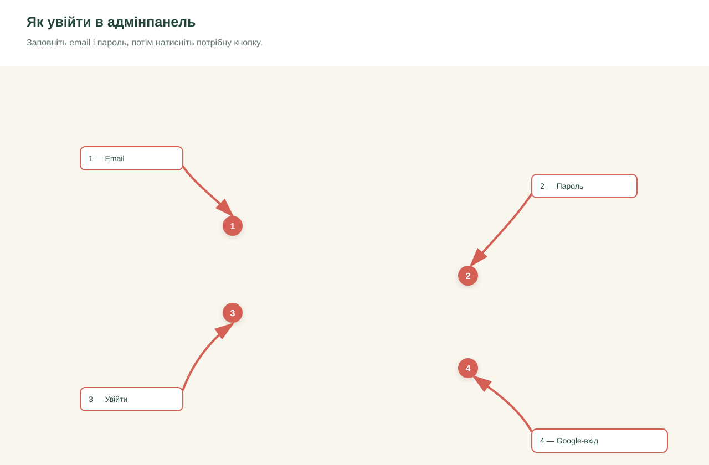

# Інструкція для адмінпанелі

## Для чого потрібна адмінпанель

Адмінпанель — це внутрішній робочий простір центру. Тут можна:

- переглядати та заповнювати анкети батьків;
- планувати заняття по залах;
- обробляти заявки з форми «Записатися на консультацію»;
- ставити запитання AI-помічнику;
- керувати обліковими записами працівників.

> Усі підписи інтерфейсу зараз українською. Дані анкет містять чутливу інформацію про дітей — не передавайте пароль і не залишайте відкриту адмінпанель на чужому комп'ютері.

## Швидкий старт

1. Відкрийте `/admin/login.html`.
2. Уведіть email і пароль або скористайтеся кнопкою «Увійти через Google», якщо Google-вхід налаштований.
3. На сторінці «Адмінпанель» відкрийте потрібний розділ.
4. Після завершення роботи натисніть «Вийти» у верхній панелі.

### Що позначено на екрані входу

① **Email** — робоча адреса, запрошена в систему.

② **Пароль** — пароль облікового запису.

③ **Увійти** — звичайний вхід через email і пароль.

④ **Увійти через Google** — альтернативний спосіб, доступний лише після налаштування Google OAuth.

Если после входа появляется «Доступ обмежено», значит аккаунт существует в Supabase Auth, но для него нет профиля в таблице `profiles` или ему не назначена роль.

## Доступи за ролями

| Возможность | Инструктор | Админ | Супер админ |
|---|:---:|:---:|:---:|
| Анкеты: просмотр и заполнение | ✓ | ✓ | ✓ |
| Расписание | ✓ | ✓ | ✓ |
| AI-помощник | ✓ | ✓ | ✓ |
| Заявки: просмотр | ✓ | ✓ | ✓ |
| Заявки: отметить «опрацьована» | — | ✓ | ✓ |
| Управление пользователями | — | просмотр | добавление и удаление |

Карточки и пункты меню, недоступные роли, не показываются. Это нормальное поведение, а не ошибка загрузки.

## Раздел «Заявки на консультацию»

Здесь отображаются обращения из публичной формы сайта: имя, телефон, возраст ребёнка, дата и статус.

### Как обработать новую заявку

1. Откройте карточку «Заявки на консультацію» на главной странице админпанели или нажмите значок колокольчика с числом новых заявок.
2. Свяжитесь с родителем по указанному телефону.
3. После разговора нажмите «Позначити опрацьованою».
4. Проверьте, что статус изменился с `Нова` на `Опрацьована`.

Заявка сохраняется в базе отдельно от email-уведомления. Если письмо не пришло, сначала проверьте эту страницу — обращение могло сохраниться.

## Раздел «Анкети»

### Найти анкету

Введите фамилию ребёнка или имя родителя в поле поиска. Таблицу можно сортировать по ребёнку, родителю или дате добавления.

### Просмотреть анкету

Нажмите на строку ребёнка. Откроется окно с данными в режиме просмотра.

### Добавить анкету вручную

1. Нажмите «Додати нову анкету».
2. Заполните поля анкеты.
3. Нажмите «Надіслати анкету».

Если для ребёнка уже есть предыдущая анкета, система покажет уведомление. Новая запись добавляется как новая версия, поэтому история не теряется.

### Импорт из CSV

1. Нажмите «Імпортувати CSV».
2. Выберите файл экспорта Google Forms.
3. Просмотрите количество найденных строк и ошибки предварительного просмотра.
4. Нажмите «Імпортувати» только после проверки.

Не импортируйте один и тот же файл повторно без необходимости: это может создать дублирующие версии анкет.

## Раздел «Розклад»

Расписание показывает один рабочий день с 08:00 до 19:00. Залы отображаются колонками.

### Записать ребёнка на занятие

1. Выберите нужную дату стрелками, кнопкой «Сьогодні» или через «Відкрити календар».
2. Нажмите нужную ячейку зала и времени.
3. Выберите специалиста.
4. Начните вводить имя ребёнка и выберите его из списка анкет.
5. Нажмите «Зберегти».

Изменения сохраняются автоматически. Если ребёнок не находится в списке, сначала добавьте его анкету.

### Отметить посещение

Откройте занятие в расписании и используйте кнопку посещения. Для пропуска предусмотрена отдельная отметка «Не прийшов».

### Управление залами и специалистами

Кнопка «Керування» раскрывает два блока:

- управление залами: переименование, добавление и удаление;
- управление специалистами: переименование, добавление и удаление.

Перед удалением проверьте, что зал или специалист больше не используется в актуальном расписании.

## Раздел «AI помічник»

AI-помощник поддерживает два режима:

- **Аналіз анкет** — вопросы по сохранённым анкетам;
- **Загальні питання** — общие научные вопросы о сенсорной интеграции, ABA и логопедии.

Пример запроса: «У яких дітей є проблеми зі сном?».

Ответ передаётся в Gemini для обработки. Чат не сохраняется автоматически — нажмите «Зберегти чат», если его нужно оставить в «Історії чатів».

AI-ответ не заменяет профессиональное решение специалиста. Используйте его как вспомогательный инструмент и перепроверяйте выводы.

## Раздел «Управління користувачами»

Раздел доступен администраторам, а добавление и удаление пользователей — супер-администратору.

### Добавить сотрудника

1. Откройте «Управління користувачами».
2. Укажите имя и email сотрудника.
3. Выберите роль.
4. Нажмите «Додати».
5. Сотрудник получит приглашение на email и задаст пароль по ссылке.

Назначайте минимально необходимую роль. Роль супер-администратора даёт доступ к управлению пользователями и не должна использоваться для обычной ежедневной работы.

## Если что-то не работает

| Симптом | Что проверить |
|---|---|
| Страница сразу возвращает на вход | Сессия истекла — войдите снова. |
| «Доступ обмежено» | У аккаунта нет профиля или роли в `profiles`. Обратитесь к супер-администратору. |
| Нет карточки раздела | Раздел скрыт для вашей роли; смотрите таблицу доступов выше. |
| Заявка есть в админке, но письмо не пришло | Проверьте папку «Спам» и логи Resend; запись в базе при этом не теряется. |
| Не сохраняется расписание | Проверьте интернет и дождитесь статуса сохранения; не закрывайте вкладку сразу после изменения. |
| AI не отвечает | Проверьте, что настроен ключ Gemini и Edge Function `ai-assistant`. |

## Безопасность

- Не отправляйте пароль в мессенджерах.
- Не используйте один аккаунт на нескольких сотрудников.
- Не скачивайте анкеты на общий компьютер без необходимости.
- Выходите из системы после работы.
- При увольнении сотрудника сразу отключайте или удаляйте его доступ.
